# EndoregDB - Professional Data Infrastructure for Clinical Research

EndoregDB is a comprehensive database framework designed to manage medical and research-related data for clinical trials. This repository focuses on efficient data processing, automated deployment, security, and reproducibility, offering a flexible setup for local development environments as well as distributed systems. It supports the integration of AI/ML tools and advanced image and report processing.

This infrastructure was originally designed for clinical research studies and is optimized for handling large data volumes, including:

- Medical reports,
- Patient imaging and video data,
- Clinical product and treatment data,
  and more.

## 🚀 Key Features

### System Architecture

- **Modular Design**: Built on scalable and reusable components to simplify integration into various environments.
- **Multi-System Support**: Manages configurations for local workstations and production servers.
- **Role-Specific Configuration**: Predefined roles for common use cases:
  - Medical data processing systems
  - AI/ML model deployment
  - Research workstation configuration

### Security & Data Management

- **Data Encryption**: All sensitive data is encrypted, and privacy policies are enforced.
- **Impermanence**: Stateless system configuration with persistence for critical data.
- **Access Control**: Role-based access and identity management integration.

### Data and Processing Environment

- **Data Processing**: Optimized for processing medical datasets with preprocessing tools.
- **AI/ML Support**:
  - Integration of machine learning tools for predictive analysis.
  - TensorFlow, PyTorch, and other frameworks supported for model training.
- **Image/Video Processing**: Support for analyzing patient images and clinical videos.

### Development Tools & Infrastructure

- **Data Science Toolchains**: Pre-configured environments for data processing, analysis, and visualization.
- **Monitoring & Logging**: Setup for continuous monitoring and logging to ensure system stability and performance.

---

## 🛠 Getting Started

### Prerequisites

- A Linux-based system (Ubuntu/Debian recommended) or NixOS
- Hardware with sufficient storage for data processing (at least 1 TB recommended)

### Quick Start

1. Clone the repository:

   ```bash
   git clone https://github.com/wg-lux/endoreg-db.git
   cd endoreg-db
   ```

2. Set up your Python environment
   We need to have a `devenv.nix` file.  
   This Nix `devenv.nix` configuration sets up a Python development environment for a Django-based project using `uv` for dependency management. It defines project directories, environment variables, runtime packages, and several development tasks and scripts.

   **Some available Test Shortcuts**

   - `runtests`: Runs all tests — `uv run python runtests.py`
   - `runtests-dataloader`: Runs dataloader tests — `uv run python runtests.py 'dataloader'`
   - `runtests-other`: Runs other miscellaneous tests — `uv run python runtests.py 'other'`
   - `runtests-helpers`: Runs helper module tests — `uv run python runtests.py 'helpers'`
   - `runtests-administration`: Runs admin module tests — `uv run python runtests.py 'administration'`
   - `runtests-medical`: Runs medical module tests — `uv run python runtests.py 'medical'`

3. Then run 

   ```bash
   direnv allow
   ```

4. Run tests:
   Call Devenv Script to run tests

   ```bash
   runtests
   ```
   Tests Overview
   - These tests ensure the functionality of different models and scenarios.
   - After running them, you can view the results as demonstrated in the image below:
   
   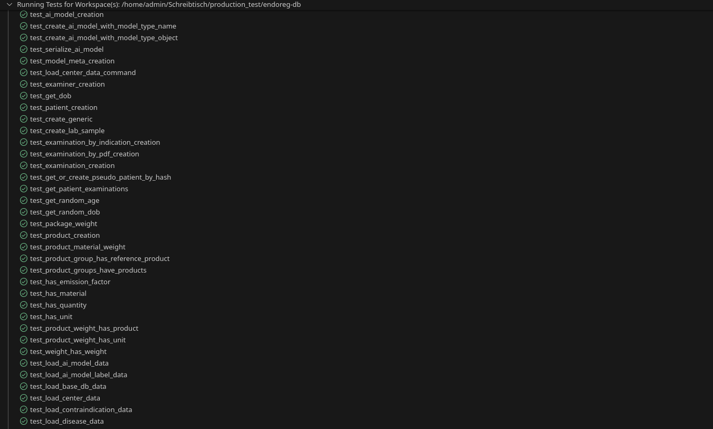

5. Run 
   ```python
   python manage.py migrate
   
   ``` 
   - It applies database migrations and make tables.
   - It updates your database schema to match the current state of your Django models.

6. To load the database data run 
   ```
   python manage.py load_base_db_data

   ```
   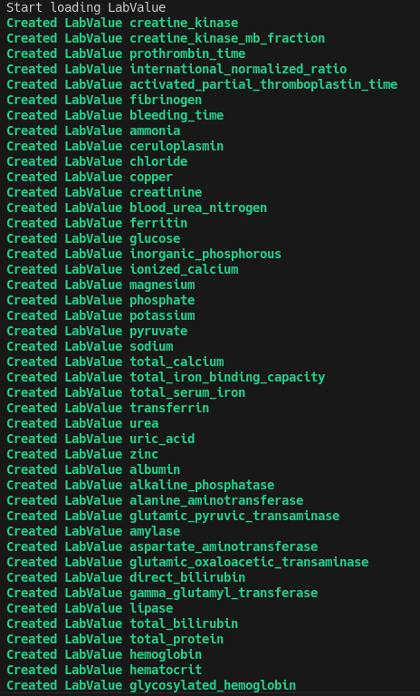
   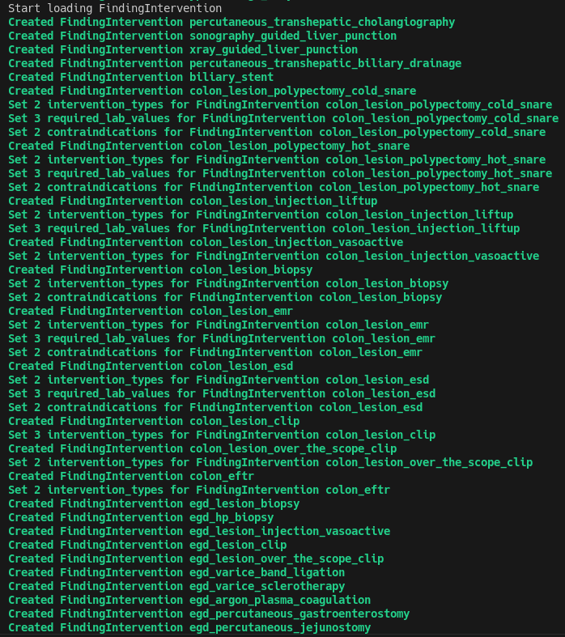
   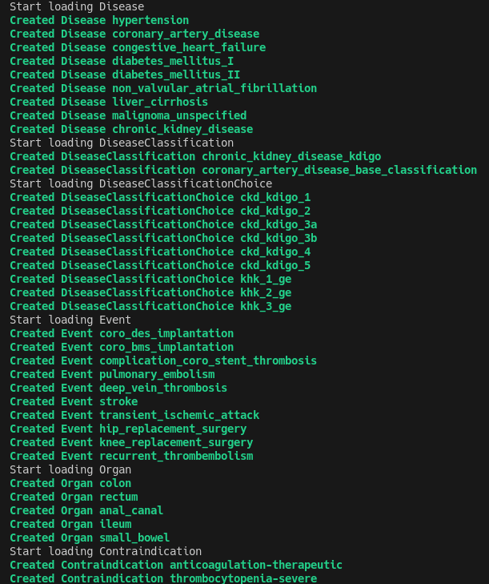
   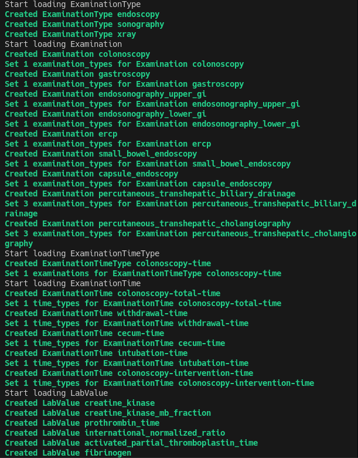
   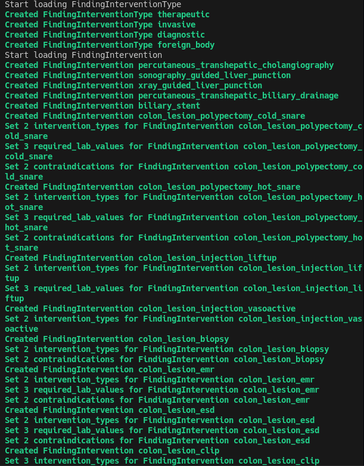
   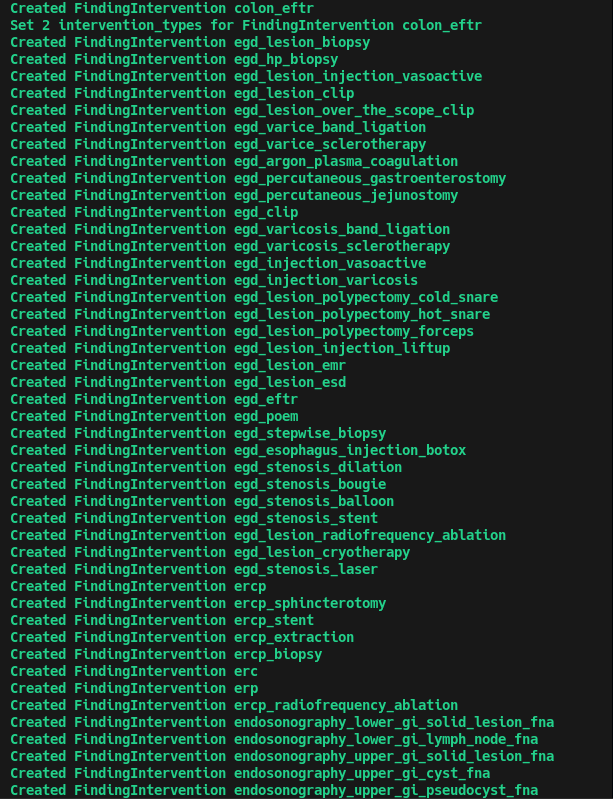
   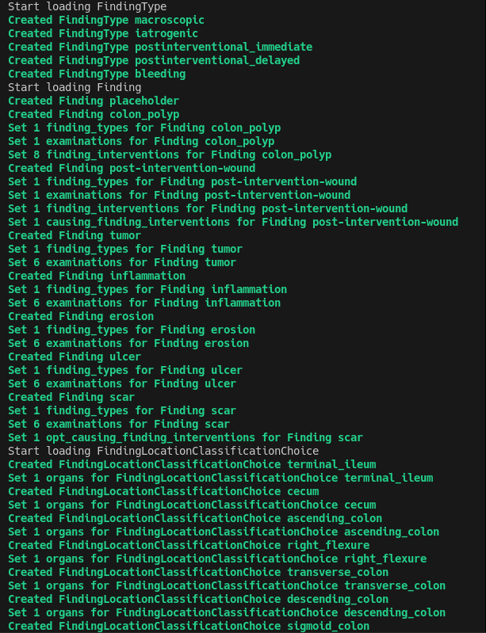

7. Accessing the Django Shell
   - To fetch or interact with data in the terminal, run the following command to run the Django shell:

   ```bash
      python manage.py shell
   ```
   - Using the Django shell, you can:
      - Import database models
      - Fetch data from the database
      - Access related data through model relationships (e.g., foreign keys, one-to-many, many-to-many)
      - Example is shown below

   #### EXAMPLE # 1
   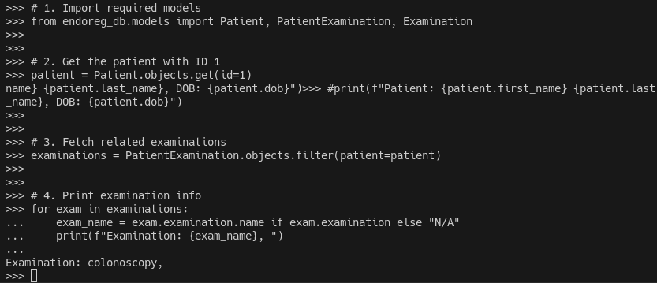
   - Explanation:
      This script fetches a patient by ID and prints their related examination(s) using Django ORM. It retrieves the examination name linked to the patient from the PatientExamination table.
      
   #### EXAMPLE # 2
   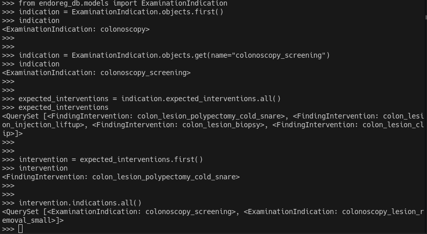
   - Explanation:
      In the Django shell, a specific ExaminationIndication named "colonoscopy_screening" was fetched, and its related FindingIntervention records were accessed using the reverse relation expected_interventions. The first intervention (colon_lesion_polypectomy_cold_snare) was then queried to confirm it is also linked to multiple indications, demonstrating a many-to-many relationship between indications and interventions.
   
   #### EXAMPLE # 3
   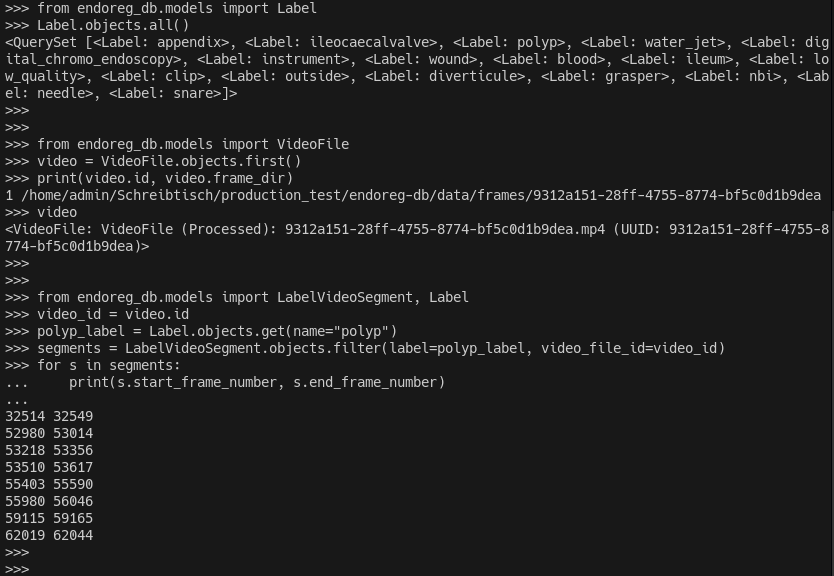
   - Explanation:
      All required labels (polyp, instrument, digital_chromo_endoscopy, etc.) are confirmed to exist. The first available video (VideoFile) was loaded, with a valid frame_dir. Using the label "polyp", 8 labeled polyp segments were found in that video, with specific start and end frame numbers.

   #### EXAMPLE # 4
   ##### Image a

   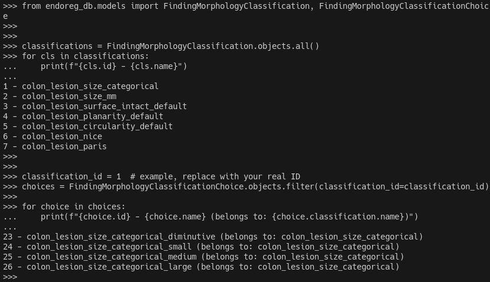

   ##### Image b - All classifications with their choices together

   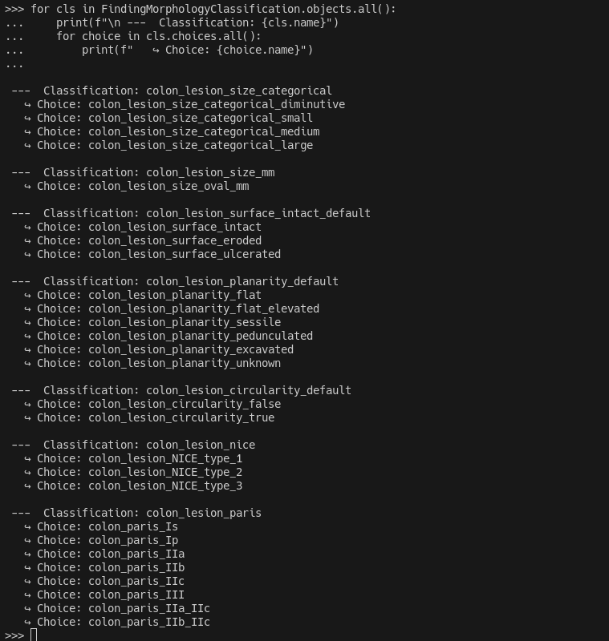

   - Explanation: Using the Django shell to fetch all morphology classifications (e.g., NICE, Paris) and their related choices  from the database.


---


## 📁 Repository Structure

```
endoreg-db/
├── endoreg_db/                # Main Django app for medical data
│   ├── case_generator/        # Sample case generator
│   ├── data/                  # Medical knowledge base
│   ├── management/            # Data wrangling operations
│   ├── models/                # Data models
│   ├── migrations/            # Database migrations
│   └── serializers/           # Serializers for data
├── .gitignore                 # Git ignore file for unnecessary files
└── README.md                  # Project description and setup instructions
```

---

## 🔒 Security Features

- **Data Encryption**: All sensitive patient data is encrypted.
- **Role-Based Access Control**: Configurable roles for managing access to various parts of the system.
- **Logging & Auditing**: Comprehensive logging system that tracks user activities and data changes.

---

## 🖥️ Supported Systems

- **Workstations**: Local development or research workstations with low data processing demands.
- **Servers**: Scalable server infrastructure for processing large data volumes, integrated with cloud services for scalability.

---

## 🛟 Support

For issues and questions:

- Create an issue in the repository
- Review the Deployment Guide for common issues

---

## 📜 License

MIT - see LICENSE

---
