[](https://devenv.sh)

# EndoregDB - Professional Data Infrastructure for Clinical Research

EndoregDB is a comprehensive database framework designed to manage medical and research-related data for clinical trials. This repository focuses on efficient data processing, automated deployment, security, and reproducibility, offering a flexible setup for local development environments as well as distributed systems. It supports the integration of AI/ML tools and advanced image and report processing.

This infrastructure was originally designed for clinical research studies and is optimized for handling large data volumes, including:

- Medical reports,
- Patient imaging and video data,
- Clinical product and treatment data,
  and more.

## Ingress contract

The package supports two first-class ingest boundaries:

- `watcher`: trusted local filesystem intake
- `api`: authenticated remote upload intake

Both boundaries create `UploadJob` records and converge on the same shared ingest services. The downstream processing model is shared; only the trust boundary differs.

For shared multi-center deployments, set
`ENDOREG_DEPLOYMENT_ROLE=central_hub`. In that role the package requires
authenticated API uploads with declared `center_key` and refuses
default-center fallback on the API path.

AI and automation consumers should use the API read surfaces for reports, videos, frames, and patient timelines rather than reading `STORAGE_DIR` directly. Those media endpoints are the package-level contract for center-scoped access.

The node-to-node transfer API under `/api/media/hub/transfers/` is supported
for `central_hub` deployments. In `standalone` and `site_node` deployments
those endpoints return `404`. `/api/upload/` remains the primary hub boundary.

For the current transport-security phase, transfer deployments must:

- use HTTPS or equivalent secure transport
- require proxy-verified mTLS for node-authenticated transfer requests
- keep `NetworkNode.shared_secret` limited to request authentication rather than payload encryption

Production deployments behind a TLS-terminating proxy must configure Django to
trust only the proxy's HTTPS signal:

```bash
DJANGO_SECURE_PROXY_SSL_HEADER_NAME=HTTP_X_FORWARDED_PROTO
DJANGO_SECURE_PROXY_SSL_HEADER_VALUE=https
```

The proxy must strip any inbound client-supplied `X-Forwarded-Proto` and
`X-Client-Cert-Verified` headers, then set `X-Forwarded-Proto: https` only for
requests that arrived over HTTPS. Central hub transfer deployments must also
set `ENDOREG_HUB_TRANSFER_REQUIRE_MTLS=true` and forward the configured mTLS
attestation header, for example `X-Client-Cert-Verified: SUCCESS`, only after
successful client certificate verification.

For downstream upgrade and deployment impact, see
[`docs/deployment_note_hub_contract.md`](docs/deployment_note_hub_contract.md).
For the full current-state hub behavior, see
[`docs/wiki/hub_ingest_current_state.md`](docs/wiki/hub_ingest_current_state.md).

## Ingest workflow

The package is designed around one shared ingest core with multiple boundary adapters:

1. `watcher`, `api`, or optional `transfer` ingress accepts a file or transfer payload.
2. The boundary resolves `center_key` scope and creates an `UploadJob` or `TransferJob`.
3. Provenance is normalized at creation time so audit and cleanup logic do not depend on caller-specific payload shapes.
4. Shared processing services import, anonymize, and link the resulting media objects.
5. Retention policy decides cleanup eligibility.

The cleanup contract is strict:

- `UploadJob.retention_policy=preserve_source`: successful completion keeps the source artifact and marks cleanup as `skipped`
- `UploadJob.retention_policy=delete_after_success`: successful completion marks the source artifact as cleanup-eligible
- `TransferJob.cleanup_policy=retain_all`: no cleanup is requested
- transfer cleanup policies other than `retain_all` are recorded as deferred operator intent

This keeps ingest behavior idempotent, auditable, and safe for production cleanup automation.

## 🚀 Key Features

### System Architecture

- **Modular Design**: Built on scalable and reusable components to simplify integration into various environments.
- **Multi-System Support**: Manages configurations for local workstations and production servers.
- **Role-Specific Configuration**: Predefined roles for common use cases:
  - Medical data processing systems
  - AI/ML model deployment
  - Research workstation configuration

### Security & Data Management

- **Protected storage**: Media artifacts use application-encrypted storage or an approved encrypted-filesystem streaming mode, depending on their typed storage profile. Production operators must provide the encrypted storage boundary.
- **Fail-closed production configuration**: Production roles validate their database, authentication, transport, and protected-storage settings at startup.
- **Access Control**: Role-based access and identity management integration.

### Data and Processing Environment

- **Data Processing**: Optimized for processing medical datasets with preprocessing tools.
- **AI/ML Support**:
  - Integration of machine learning tools for predictive analysis.
  - TensorFlow, PyTorch, and other frameworks supported for model training.
- **Image/Video Processing**: Support for analyzing patient images and clinical videos.

### Development Tools & Infrastructure

- **Data Science Toolchains**: Pre-configured environments for data processing, analysis, and visualization.
- **Monitoring & Logging**: Setup for continuous monitoring and logging to ensure system stability and performance.

---

## 🛠 Getting Started

### Prerequisites

- A Linux-based system (Ubuntu/Debian recommended) or NixOS
- Hardware with sufficient storage for data processing (at least 1 TB recommended)

### Quick Start

1. Clone the repository:

   ```bash
   git clone https://github.com/wg-lux/endoreg-db.git
   cd endoreg-db
   ```

2. Set up your Python environment
   The checked-in `devenv.nix` configures the Python 3.12 development environment and uses `uv` for dependency management.

   **Some available Test Shortcuts**

   - `runtests`: Runs all tests — `uv run python runtests.py`
   - `runtests-dataloader`: Runs dataloader tests — `uv run python runtests.py 'dataloader'`
   - `runtests-other`: Runs other miscellaneous tests — `uv run python runtests.py 'other'`
   - `runtests-helpers`: Runs helper module tests — `uv run python runtests.py 'helpers'`
   - `runtests-administration`: Runs admin module tests — `uv run python runtests.py 'administration'`
   - `runtests-medical`: Runs medical module tests — `uv run python runtests.py 'medical'`

3. Then run 

   ```bash
   direnv allow
   ```

4. Run tests:
   Call Devenv Script to run tests

   ```bash
   runtests
   ```
   Tests Overview
   - These tests ensure the functionality of different models and scenarios.
   - After running them, you can view the results as demonstrated in the image below:
   
   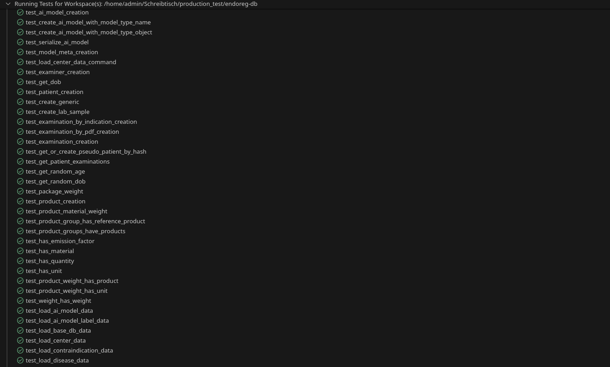

5. Run 
   ```python
   python manage.py migrate
   
   ``` 
   - It applies database migrations and make tables.
   - It updates your database schema to match the current state of your Django models.

6. To load the database data run 
   ```
   python manage.py load_base_db_data

   ```
   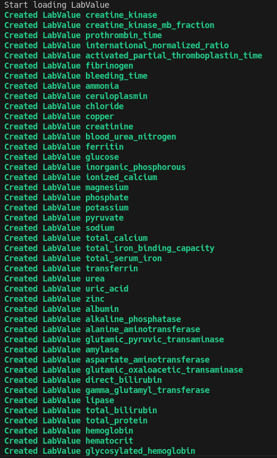
   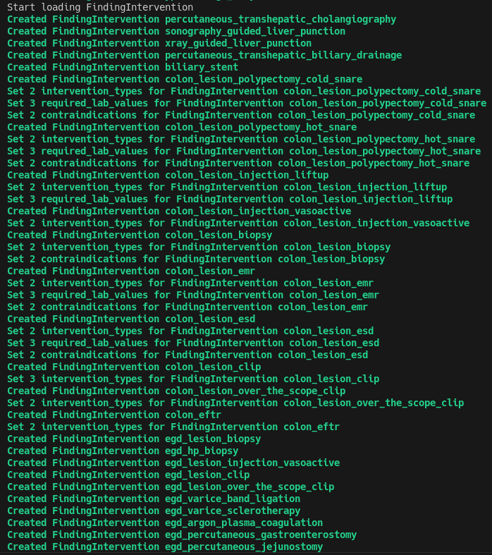
   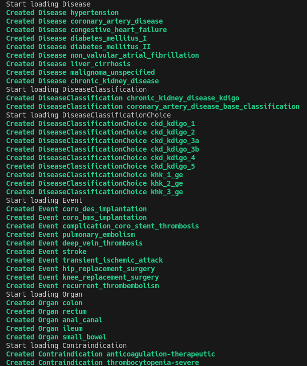
   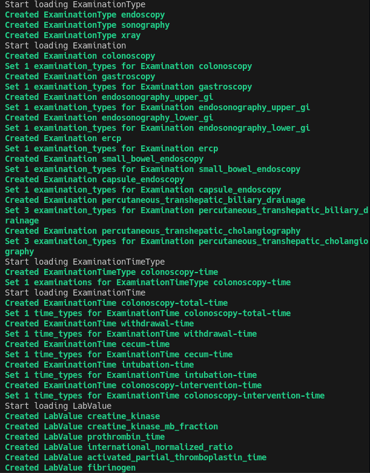
   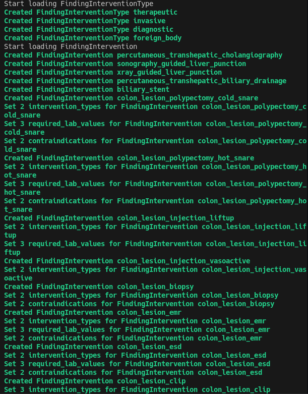
   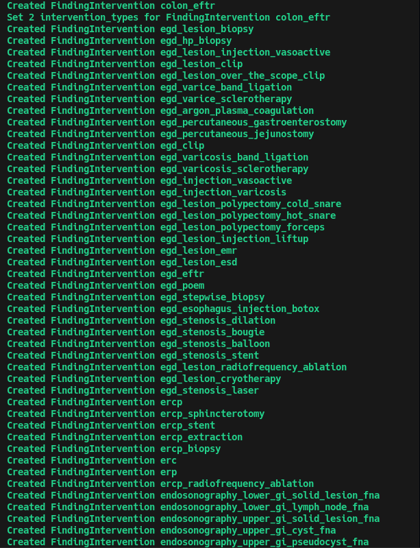
   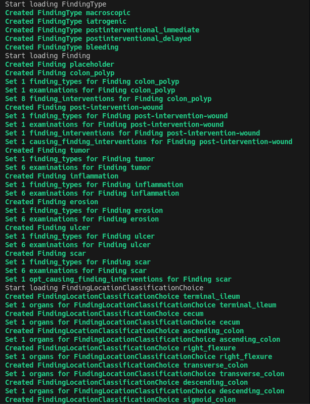

7. Accessing the Django Shell
   - To fetch or interact with data in the terminal, run the following command to run the Django shell:

   ```bash
      python manage.py shell
   ```
   - Using the Django shell, you can:
      - Import database models
      - Fetch data from the database
      - Access related data through model relationships (e.g., foreign keys, one-to-many, many-to-many)
      - Example is shown below

   #### EXAMPLE # 1
   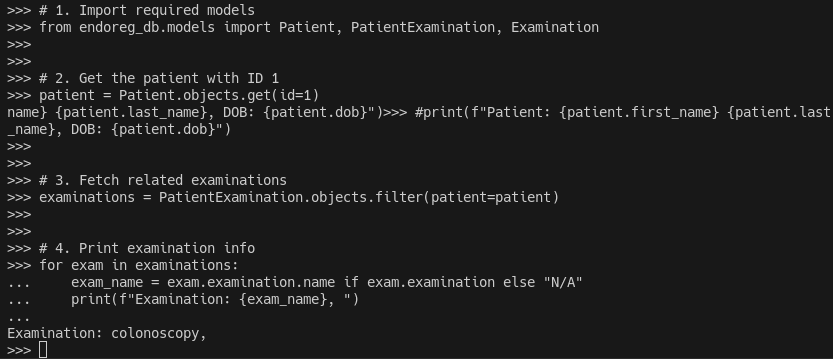
   - Explanation:
      This script fetches a patient by ID and prints their related examination(s) using Django ORM. It retrieves the examination name linked to the patient from the PatientExamination table.
      
   #### EXAMPLE # 2
   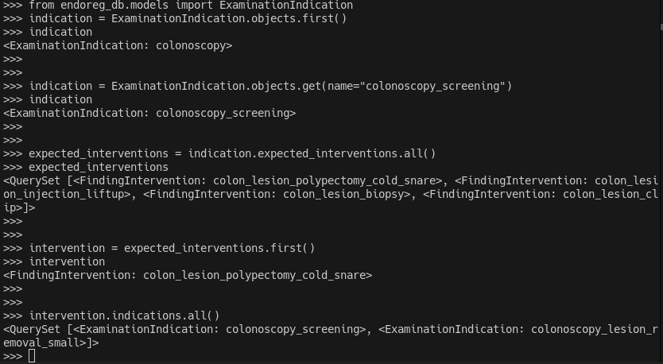
   - Explanation:
      In the Django shell, a specific ExaminationIndication named "colonoscopy_screening" was fetched, and its related FindingIntervention records were accessed using the reverse relation expected_interventions. The first intervention (colon_lesion_polypectomy_cold_snare) was then queried to confirm it is also linked to multiple indications, demonstrating a many-to-many relationship between indications and interventions.
   
   #### EXAMPLE # 3
   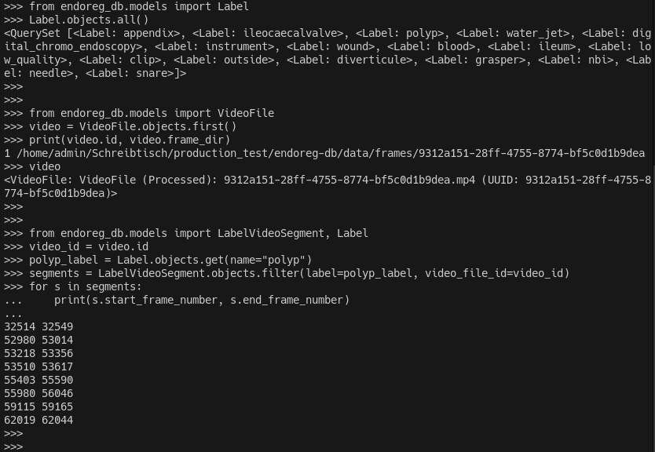
   - Explanation:
      All required labels (polyp, instrument, digital_chromo_endoscopy, etc.) are confirmed to exist. The first available video (VideoFile) was loaded, with a valid frame_dir. Using the label "polyp", 8 labeled polyp segments were found in that video, with specific start and end frame numbers.

   #### EXAMPLE # 4
   ##### Image a

   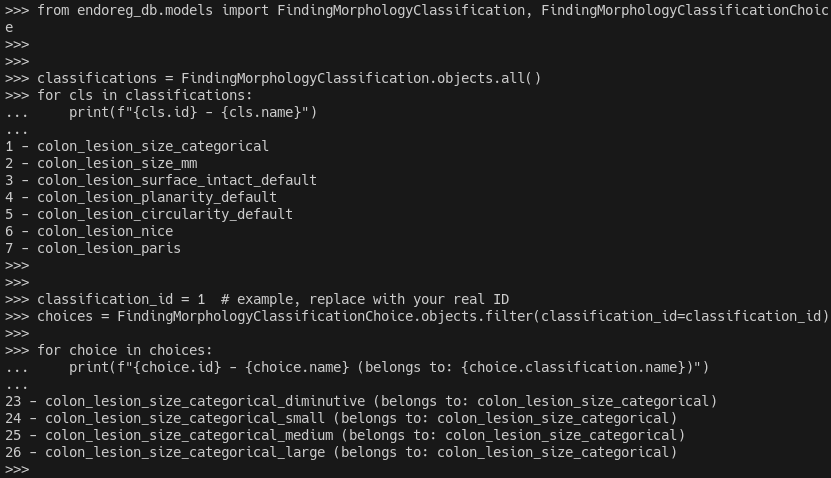

   ##### Image b - All classifications with their choices together

   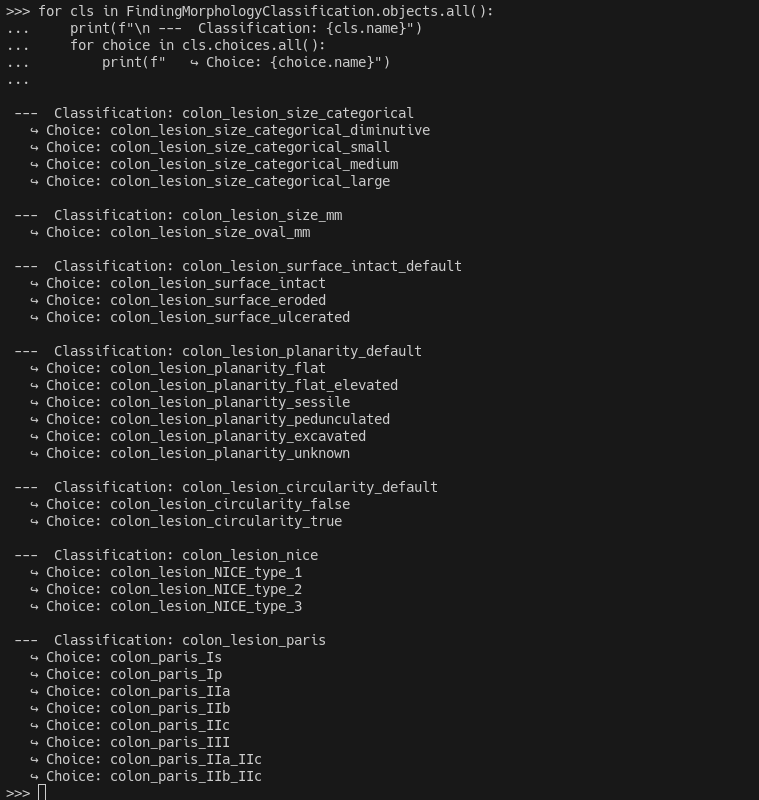

   - Explanation: Using the Django shell to fetch all morphology classifications (e.g., NICE, Paris) and their related choices  from the database.


## Testing

Before running tests, dev mode needs to be activated.

```bash
direnv allow
devenv tasks run agent:sync
```

This synchronizes the development environment and installs the configured development dependencies.

For testing, this repository provides a general skip condition.

```bash
export SKIP_EXPENSIVE_TESTS=true
```

If you want to run a full suite, run in your shell:

```bash
export SKIP_EXPENSIVE_TESTS=false
```

or change the default.

Use the repository's devenv tasks to synchronize and run the intended test lane.
```bash
devenv tasks run test:sync # syncs the uv dev dependencies
devenv tasks run test:fast
devenv tasks run test:heavy
devenv tasks run test:full
devenv tasks run test:clean
```

To run profiling, use the following command:
```bash
scripts/run_profiling_suite.sh --master-key-file tests/assets/test_master_key.txt
```

## 📦 Database Backup and Restore

The repository still contains legacy `export_db.sh` and `import_db.sh` fixture scripts, but they are not currently operational: both invoke the absent `fix_endoreg_db_backup_json.py` helper. Do not use them as a production backup or restore mechanism until that workflow is repaired and verified.

Use the backup and recovery procedure defined for the active deployment environment. Django JSON fixtures do not replace database backups or protected-media recovery.


## 📁 Repository Structure

```
endoreg-db/
├── endoreg_db/                # Main Django app for medical data
│   ├── data/                  # Medical knowledge base
│   ├── management/            # Data wrangling operations
│   ├── models/                # Data models
│   ├── migrations/            # Database migrations
│   └── serializers/           # Serializers for data
├── .gitignore                 # Git ignore file for unnecessary files
└── README.md                  # Project description and setup instructions
```

---

## 🔒 Security Features

- **Protected media storage**: Sensitive media uses application encryption or an approved encrypted filesystem, according to its storage profile.
- **Role-Based Access Control**: Configurable roles for managing access to various parts of the system.
- **Audit records**: Security-relevant workflows emit structured logs and selected state changes are recorded in the audit ledger; coverage is workflow-specific.

---

## 🖥️ Supported Systems

- **Workstations**: Local development or research workstations with low data processing demands.
- **Servers**: Scalable server infrastructure for processing large data volumes, integrated with cloud services for scalability.

---

## 🛟 Support

For issues and questions:

- Create an issue in the repository
- Review the Deployment Guide for common issues

---

## 📜 License

GNU General Public License v3.0 - see [LICENSE](LICENSE).

---


## 📖 Further Documentation

Repository-maintained documentation lives under [`docs/`](docs/). The project **[Wiki](https://github.com/wg-lux/endoreg-db/wiki)** also contains historical and supplementary material; wiki pages are not authoritative for current production readiness.

### Standalone Modules In This Checkout

The local development layout includes a report renderer and can use a companion terminology editor checkout:

- `tools/report_pdf_renderer_rust`: Rust PDF renderer source used by the repository Make targets
- `lx-terminology-editor`: companion checkout expected next to this repository

#### Report PDF renderer with Nix

From the `endoreg-db` repository root:

```bash
make report-renderer-run-example-devenv
```

To wire it into `endoreg_db`:

```bash
make report-renderer-install-devenv
eval "$(make -s report-renderer-env)"
```

#### `lx-terminology-editor` with Nix

From the repo root:

```bash
cd ../lx-terminology-editor
direnv allow   # optional
devenv shell
python server.py
```

Then open:

```text
http://localhost:4173
```

The editor can publish a terminology bundle locally under:

```text
../lx-terminology-editor/.published/<publish-name>/<version>/
```

and writes a registry file at:

```text
../lx-terminology-editor/.published/kb_registry.json
```


### Optimization Documentation
- [Complete Optimization Project Report](https://github.com/wg-lux/endoreg-db/wiki/Complete-Optimiztion-Project-Report)
- [Test Performance Optimization Guide](https://github.com/wg-lux/endoreg-db/wiki/Test-Performance-Optimization-Guide)
- [Test Performance Optimization - Success Summary](https://github.com/wg-lux/endoreg-db/wiki/Test-Performance-Optimization-‐-Succes-Summary)
- [Test Performance Optimization: Complete Implementation Summary](https://github.com/wg-lux/endoreg-db/wiki/Test-Performance-Optimization:-Complete-Implementation-Summary)
- [Test Suite Optimization - Final Status Report](https://github.com/wg-lux/endoreg-db/wiki/Test-Suite-Optimization-‐-Final-Status-Report)
- [Test Suite Analysis & Optimization Plan](https://github.com/wg-lux/endoreg-db/wiki/Test-Suite-Analysis-&-Optimization-Plan)

---

### Models and Migration Documentation
- [Models Documentation](https://github.com/wg-lux/endoreg-db/wiki/Models-Documentation)
- [Test Migration & Optimization Report](https://github.com/wg-lux/endoreg-db/wiki/Test-Migration-&-Optimization-Report)
- [Test Migration Success Summary](https://github.com/wg-lux/endoreg-db/wiki/Test-Migration-Success-Summary)
- [Test Optimization Migration Guide](https://github.com/wg-lux/endoreg-db/wiki/Test-Optimization-Migration-Guide)

---

### API Documentation
- [Upload API Documentation](https://github.com/wg-lux/endoreg-db/wiki/Upload-API-Documentation)

---

### Frame Anonymization
- [Frame Anonymization](https://github.com/wg-lux/endoreg-db/wiki/Frame-Anonymisierung)

---

### Tutorials Documentation
- [Run Production Server](https://github.com/wg-lux/endoreg-db/wiki/Run-Production-Server)
- [Date and Time Standardization for Models](https://github.com/wg-lux/endoreg-db/wiki/Date-and-Time-Standardization-for-Models)

---

### Keycloak
- [How to Create a New Account for Keycloak + Nextcloud](https://github.com/wg-lux/endoreg-db/wiki/How-to-Create-a-New-Account-for-Keycloak-+-Nextcloud)
- [Integration with the frontend](https://github.com/wg-lux/endoreg-db/wiki/Integration-with-the-frontend)
- [Merging Multi-User Accounts in Nextcloud // current options](https://github.com/wg-lux/endoreg-db/wiki/Merging-Multi-User-Accounts-in-Nextcloud-//-current-options)
- [New user login steps for keycloak and nextcloud](https://github.com/wg-lux/endoreg-db/wiki/New-user-login-steps-for-keycloak-and-nextcloud)
- [keycloak integration with backend endpoint](https://github.com/wg-lux/endoreg-db/wiki/keycloak-integration-with-backend-endpoint)

---

### Coding Principles & Practices
- [Timestamp Naming Standard](https://github.com/wg-lux/endoreg-db/wiki/Timestamp-Naming-Standard)

---

### Figures
- [Coloreg](https://github.com/wg-lux/endoreg-db/wiki/Coloreg)
- [EndoReg Framework](https://github.com/wg-lux/endoreg-db/wiki/EndoReg-Framework)
- [EndoReg Data Collection Workflow](https://github.com/wg-lux/endoreg-db/wiki/EndoReg-Data-Collection-Workflow)
- [A Shared Data Platform for Clinical Care and Research](https://github.com/wg-lux/endoreg-db/wiki/Eine-gemeinsame-Datenplattform-für-Klinik-&-Forschung)

---

### Miscellaneous
- [Requirement System Guide](https://github.com/wg-lux/endoreg-db/wiki/Requirement-System-Guide)
- [Official Site Link](https://github.com/wg-lux/endoreg-db/wiki/Official-Site-Link)
