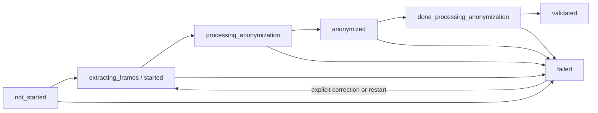

# Anonymization and Release Contract

This reference defines the protection scope, release boundaries, and
operational roles for videos, frames, and reports. Production readiness is
assessed only in `feature-tracking/Anonymization.yml`.

## Overview

```text
Raw medium
+-- Video
|   +-- Frame extraction
|   +-- Anonymization and correction
|   +-- Processed video
|       +-- Human validation
|       +-- Quality evidence
|       +-- Export and streaming approval
+-- Report
    +-- Text and PDF anonymization
    +-- Processed report
        +-- Human validation
        +-- Quality evidence
        +-- Controlled release
```

## Protection Scope

Direct identifiers include, at minimum, patient and examiner names, date of
birth, examination date and time, case number, endoscope serial number,
external identifiers, file paths, and identifying raw or free text. For video,
the scope includes visible protected-health-information regions both inside
and outside the endoscopic image. For reports, it includes Portable Document
Format (PDF) content, extracted text, and structured metadata.

Raw videos, raw frames, and raw reports must not leave the local encrypted
storage boundary. Export, hub transfer, and external streaming use only
processed artifacts that have been validated by a human. The long-lived
master key remains local and is not stored in payloads, application
configuration, or the database. `NetworkNode.shared_secret` is used only for
request authentication.

## State and Release Model



Only `validated` permits clinical release. In the `local_study_server`
profile, release additionally requires `outside_segments_removed`,
`ready_for_export`, and matching Secure Hash Algorithm 256-bit (SHA-256)
evidence for the current `processed_file`. Missing, contradictory, or stale
evidence fails closed. A correction or artifact replacement revokes export
approval; earlier processing and audit records are preserved.

After validation of an outside segment, the post-validation job rebuilds the
processed video using only validated outside intervals. It also atomically
blackens every already extracted frame file in those intervals. The job checks
the video and frame files; missing, unreadable, or non-black outside frames
prevent `outside_segments_removed` and therefore prevent export approval.

## Quality Boundaries

Release is permitted only when all of these conditions hold:

- human anonymization validation is complete;
- the processed artifact exists and has traceable SHA-256 evidence;
- no known direct identifiers remain in the reviewed corpus;
- the number of false-negative protected-health-information regions in video
  is zero;
- missing sensitive-metadata, optical-character-recognition, model-version,
  or hash evidence is not treated as successful quality evidence;
- media in `failed` or `lost` state is neither released nor exported.

Quality assessment persists status, metrics, model or information source,
artifact hash, human validation, and warnings. Warnings such as
`residual_ocr_not_measurable` or `processed_artifact_hash_not_available` must
be resolved before clinical release.

## Developer Guidance

Use the existing state and service helpers for state transitions. New workflow
logic belongs in services, not persistence models. Export and transfer paths
must enforce `anonymization_validated`, the current `processed_file`, and all
profile-specific release gates on the server. Every external boundary must
reject direct identifiers, raw text, and raw media.

Before changes, run Pyright and the tests recorded in
`feature-tracking/Anonymization.yml`. Additional security-boundary coverage is
in `tests/services/test_export_frames_contract.py`,
`tests/services/test_transfer_job_contract.py`, and
`tests/views/media/test_hub_transfer_endpoints.py`.

## Clinical Reviewer Guidance

Reviewers compare the complete processed video or report with its associated
sensitive metadata. They confirm removal of direct identifiers, every visible
protected-health-information region, and video content outside the accepted
intervals. A warning or missing evidence requires rejection and documented
correction, never release.

Validation occurs only through the authenticated anonymization workflow. The
server records the reviewer, time, decision, and comment in audit and quality
data. Every correction or recomputation requires a new review.

## Operator Guidance

The daily health check reports `failed_videos`, `failed_reports`, and
`stale_video_histories` under `local_study_server.anonymization_processing`.
Pending or running histories older than seven hours are stale. Any nonzero
counter marks the corresponding check unhealthy and produces a nonzero exit
code suitable for systemd and journald alerting.

On failure, evidence is preserved. Operators inspect history, structured logs,
quarantine, and the audit ledger; repair the cause; and start the existing
idempotent correction or reimport workflow. Manual database changes or deletion
of failure history are not valid recovery. Recovery is complete only after a
successful rebuild, renewed human validation, quality assessment, and export
approval.

A production-like acceptance exercise includes at least:

1. A healthy health check with all counters at zero and exit code zero.
2. A medium with `processing_error=true`; the health check must fail.
3. Processing history that has remained active for more than seven hours; the
   health check must fail.
4. An explicit restart that preserves the old history and audit data.
5. Renewed validation and quality assessment before export approval.

Deployment, systemd timers, quarantine, and concrete commands are documented
in `docs/local_study_server_deployment.md`.
