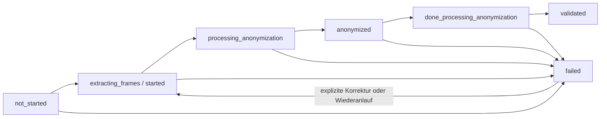

# Anonymisierungs- und Freigabe-Contract

Diese Referenz definiert den Schutzumfang, die Freigabegrenzen und die
Betriebsrollen für Videos, Frames und Berichte. Die Produktionsreife wird
ausschließlich im Feature-Tracker unter `feature-tracking/Anonymization.yml`
bewertet.

## Gesamtbild

```text
Rohmedium
+-- Video
|   +-- Frame-Extraktion
|   +-- Anonymisierung und Korrektur
|   +-- verarbeitetes Video
|       +-- menschliche Validierung
|       +-- Qualitätsnachweis
|       +-- Export-/Streaming-Freigabe
+-- Bericht
    +-- Text- und PDF-Anonymisierung
    +-- verarbeiteter Bericht
        +-- menschliche Validierung
        +-- Qualitätsnachweis
        +-- kontrollierte Bereitstellung
```

## Schutzumfang

Direkte Identifikatoren umfassen mindestens Vor- und Nachnamen von Patient und
Untersucher, Geburtsdatum, Untersuchungsdatum und -zeit, Fallnummer,
Endoskop-Seriennummer, externe IDs, Dateipfade sowie identifizierenden Roh- und
Freitext. Bei Videos gehören eingeblendete PHI-Regionen innerhalb und außerhalb
des Endoskopbildes zum Schutzumfang. Bei Berichten gehören PDF-Inhalt,
extrahierter Text und strukturierte Metadaten dazu.

Rohvideos, Rohframes und Rohberichte dürfen den lokalen verschlüsselten
Speicherbereich nicht verlassen. Export, Hub-Transfer und externes Streaming
verwenden ausschließlich verarbeitete, menschlich validierte Artefakte. Der
langfristige Master-Key bleibt lokal und wird weder in Payloads noch in
Anwendungskonfiguration oder Datenbank gespeichert. `NetworkNode.shared_secret`
dient ausschließlich der Request-Authentisierung.

## Zustands- und Freigabemodell



Nur `validated` erlaubt die fachliche Freigabe. Im Profil
`local_study_server` kommen `outside_segments_removed`, `ready_for_export` und
ein passender SHA-256-Nachweis des aktuellen `processed_file` hinzu. Fehlende,
widersprüchliche oder veraltete Evidenz führt fail-closed zur Ablehnung. Eine
Korrektur oder ein Artefaktwechsel hebt die Exportfreigabe auf; frühere
Verarbeitungs- und Auditdaten werden nicht überschrieben.

Nach der Validierung eines Outside-Segments baut der Post-Validation-Job das
verarbeitete Video ausschließlich mit den validierten Outside-Intervallen neu
auf. Zusätzlich werden sämtliche bereits extrahierten Frame-Dateien in diesen
Intervallen atomar vollständig schwarz geschrieben. Der Job prüft Video und
Frame-Dateien; fehlende, unlesbare oder nicht schwarze Outside-Frames verhindern
`outside_segments_removed` und damit jede Exportfreigabe.

## Qualitätsgrenzen

Eine Freigabe ist nur zulässig, wenn alle folgenden Grenzen erfüllt sind:

- menschliche Anonymisierungsvalidierung ist abgeschlossen;
- das verarbeitete Artefakt existiert und sein SHA-256 ist nachvollziehbar;
- keine bekannten direkten Identifikatoren verbleiben im geprüften Korpus;
- für Video-PHI-Regionen beträgt die Zahl falsch-negativer Regionen `0`;
- fehlende Sensitive-Meta-, OCR-, Modellversions- oder Hash-Evidenz wird nicht
  als erfolgreicher Qualitätsnachweis interpretiert;
- Medien im Zustand `failed` oder `lost` werden weder freigegeben noch exportiert.

Die Qualitätsauswertung persistiert Status, Metriken, Modell-/Informationsquelle,
Artefakthash, menschliche Validierung und Warnungen. Warnungen wie
`residual_ocr_not_measurable` oder `processed_artifact_hash_not_available`
müssen vor einer klinischen Freigabe geklärt werden.

## Anleitung für Entwickler

Zustandsübergänge werden über die vorhandenen State- und Service-Helfer
ausgeführt. Neue Workflowlogik gehört nicht in Persistenzmodelle. Export- und
Transferpfade müssen serverseitig auf `anonymization_validated`, das aktuelle
`processed_file` und die profilabhängigen Freigaben prüfen. Direkte
Identifikatoren, Rohtext und Rohmedien sind an jeder externen Grenze abzulehnen.

Vor Änderungen sind Pyright und die in `feature-tracking/Anonymization.yml`
hinterlegten Testkommandos auszuführen. Sicherheitsgrenzen werden zusätzlich
durch `tests/services/test_export_frames_contract.py`,
`tests/services/test_transfer_job_contract.py` und
`tests/views/media/test_hub_transfer_endpoints.py` abgedeckt.

## Anleitung für klinische Reviewer

Reviewer prüfen das verarbeitete Video beziehungsweise den verarbeiteten
Bericht vollständig gegen die zugehörigen sensiblen Metadaten. Zu bestätigen
sind die Entfernung direkter Identifikatoren, aller sichtbaren PHI-Regionen und
der außerhalb liegenden Videosegmente. Qualitätswarnungen oder fehlende Evidenz
führen zur Ablehnung und dokumentierten Korrektur, niemals zur Freigabe.

Die Validierung erfolgt ausschließlich über den authentisierten
Anonymisierungsworkflow. Reviewer dokumentieren Entscheidung und Kommentar;
Zeitpunkt und Akteur werden serverseitig in Audit- und Qualitätsdaten erfasst.
Nach jeder Korrektur oder Neuberechnung ist erneut zu prüfen.

## Anleitung für Betreiber

Der tägliche Health-Check liefert unter
`local_study_server.anonymization_processing` die Zähler `failed_videos`,
`failed_reports` und `stale_video_histories`. Pending- oder Running-Historien
gelten nach sieben Stunden als stale. Jeder Wert größer null setzt den
entsprechenden Check auf `false`, erzeugt einen Nicht-Null-Exit-Code und ist über
systemd/journald alarmierbar.

Bei einem Fehler bleibt die Evidenz erhalten. Betreiber prüfen History,
strukturiertes Log, Quarantäne und Audit-Ledger, beheben die Ursache und starten
den vorhandenen idempotenten Korrektur-/Reimport-Workflow. Ein manueller
Datenbankeingriff oder das Löschen von Fehlerhistorie ist keine zulässige
Wiederherstellung. Erst ein erfolgreicher Neuaufbau, erneute menschliche
Validierung, Qualitätsprüfung und Exportfreigabe schließen den Vorgang.

Der produktionsnahe Abnahmetest umfasst mindestens:

1. Healthy Health-Check mit Zählern `0` und Exit-Code `0`.
2. Ein Medium mit `processing_error=true`; Health-Check muss fehlschlagen.
3. Eine länger als sieben Stunden aktive Processing-History; Health-Check muss
   fehlschlagen.
4. Expliziten Wiederanlauf; alte History und Auditdaten bleiben erhalten.
5. Erneute Validierung und Qualitätsprüfung; erst danach Exportfreigabe.

Deployment, systemd-Timer, Quarantäne und konkrete Kommandos sind in
`docs/local_study_server_deployment.md` beschrieben.
