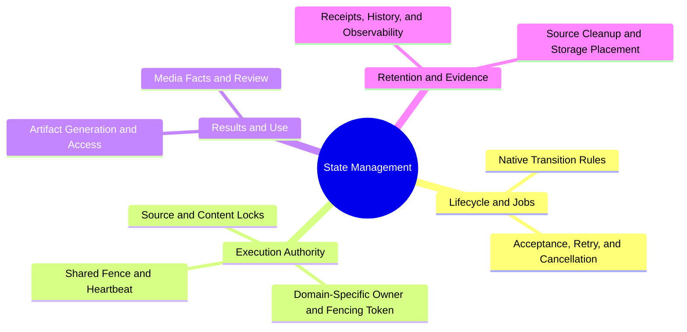
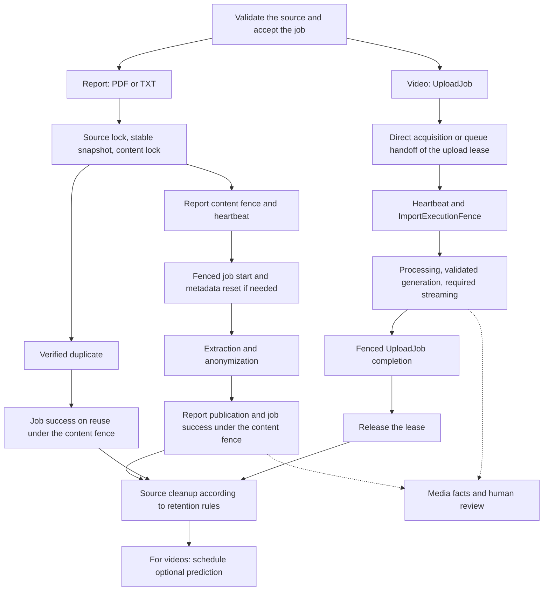

# endoreg_db — State Management

Architecture overview of the local source tree as of 2026-10-01. The relative
links point to the corresponding files; this overview describes neither
a pinned remote snapshot nor necessarily the installed package.
The binding scope and approvals are documented exclusively in
[ImportPipelineRobustness.yml](../feature-tracking/ImportPipelineRobustness.yml),
[LongRunningServiceStateMachines.yml](../feature-tracking/LongRunningServiceStateMachines.yml)
and [VideoStorageNormalization.yml](../feature-tracking/VideoStorageNormalization.yml).

The branches describe responsibilities, not an execution order.
`UploadJob.status = anonymized`, clinically confirmed anonymization, a
ready streaming artifact, and export approval are distinct statements.
A heartbeat demonstrates renewed execution authority, not processing progress.

## Shared Contract, Different Protection Scopes

[import_lease.py](../endoreg_db/services/imports/lease.py) standardizes
database time, owner/token/expiry checks, and the heartbeat with its own
database connection. Detected database failures remain visible as the original
exception for recovery; other background errors block further
mutations through the domain-specific ownership exception. The heartbeat requires
autocommit and does not close any connection belonging to the calling thread.
[ImportExecutionFence](../endoreg_db/services/imports/execution.py) bundles
the attempt identifier, synchronous validation, and a transactional mutation guard for
both formats. Direct video calls acquire an upload lease in the service wrapper;
transfer calls bring their transfer lease with them. The video-processing core
no longer provides an unprotected entry point. Long-running processing remains outside
the short-lived mutation locks; reimport preparation takes place only after lease acquisition.

| Mechanism | Protected Object | Domain Responsibility |
| --- | --- | --- |
| [UploadJobImportLease](../endoreg_db/services/hub/upload_job_import_lease.py) | An `UploadJob` | Reserved queue handoff, worker ownership, a new fencing token on takeover, cancellation, and exclusion of ongoing source cleanup. Direct and queued video imports pass the same execution fence. |
| [ReportImportFence](../endoreg_db/services/reports/import_fencing.py) | A report content hash | Import and reimport across all callers, including those without an `UploadJob`. `ReportImportService` acquires the lease itself; metadata and job callbacks run under the same content fence. |
| [TransferOperationFence](../endoreg_db/services/hub/transfers.py) | A `TransferJob` | Receive attempt, transfer owner, and fencing token. The adapter passes the same execution fence to video processing. |
| [File/Content Locks](../endoreg_db/import_files/context/file_lock.py) | Source path or content on the host, respectively | Advisory locks reduce duplicate work; they do not replace durable cluster ownership or success verification. |
| [MediaOperationLease](../endoreg_db/services/media/operation_gate.py) | Video and media operation | Coordinate playback and segment changes against transcoding, artifact publication, and cleanup. Separate conflict and expiry rules, particularly for `artifact_write`. |

The shared primitives do not determine status transitions or write
domain models. Acquisition, renewal, and completion remain short
transactions in the respective adapters. A synchronous guard does not replace
the background heartbeat; a heartbeat does not replace the atomic
ownership check when writing.

## Reports and Videos Side by Side

The two cores, [VideoImportService](../endoreg_db/import_files/video_import_service.py)
and [ReportImportService](../endoreg_db/import_files/report_import_service.py), follow
the same reading order: public entry point → `_timed_import_and_anonymize` →
`_import_and_anonymize` → the phases below. The public adapters under
`services/` retain their existing signatures.

| Shared Method | Report | Video |
| --- | --- | --- |
| `_create_import_context` | Validate the source and center; then convert TXT if necessary | Validate the source, center, and processor; bind the existing fence |
| `_process_import_pipeline` | Snapshot, source/content lock, and job source validation | Source/content lock and content hash |
| `_reuse_completed_import` | Reuse a verified report; finalize the job under the content fence | Ensure streaming is available; then perform permitted source cleanup |
| `_run_owned_import` | Acquire the content lease; prepare the record and retry | Use the existing lease; make the source available; prepare the record and retry |
| `_anonymize_and_finalize` | Anonymize text/PDF and publish the report together with the job | Validate the raw source; anonymize, normalize, and publish the video |

The following flows show report jobs and the normal raw-video upload.

Report-job integration uses a typed
[lifecycle callback contract](../endoreg_db/services/reports/import_lifecycle.py):
start/reset, success, and the attempt's own failure finalization run under the content fence.
Busy or stale attempts do not change the winning attempt's states.
Preliminary failures without valid content affect only the accepted job;
they do not delete report metadata. Direct report calls retain their
internal ownership even without job callbacks. Inline watchers and hub transfers
retain their own job adapters; the callback integration described here
applies to `services/jobs/report_llm_jobs.py`.

The file entry point in [ReportImportService](../endoreg_db/import_files/report_import_service.py)
currently accepts PDF and TXT; TXT is converted to
PDF losslessly and reproducibly. CSV, FHIR database exports, and structured LXDM reports are
additional domain-level report sources, but not additional file formats supported by this
entry point. They require their respective validated adapters. First,
the document content hash determines duplicates; then the sensitive
metadata identity determines patient linkage.

The video branch shows the normal raw-video upload. Pre-anonymized inputs
and transfers retain their own validation and provenance rules.
The [video service](../endoreg_db/import_files/video_import_service.py) also has
an explicitly unfenced compatibility entry point; this provides
no cluster-safety guarantee for its callers. Optional
segmentation is not a prerequisite for a successful import or for
otherwise permissible human review.

## State Axes and Detailed References

| Axis | Content and Boundaries | Reference |
| --- | --- | --- |
| Transition rules | Pure native reducer for `queued`, `claimed`, `running`, `retry_wait`, `succeeded`, `failed`, `cancelled`, and `lost`; shared claim/retry/recovery paths. Process states such as `starting`/`stopping` remain separate. Transition legality does not grant a lease. | [Lifecycle Service](../endoreg_db/services/runtime/lifecycle_state_machine.py), [Rust Reducer](../rust/endoreg_rust_backend/src/lifecycle_state.rs) |
| Durable jobs | `UploadJob` stores acceptance, source-/center-scoped content identity, idempotency, retry, and cancellation. A terminal state does not imply success. Report jobs reference their own processing job. | [Upload Adapter](../endoreg_db/services/hub/upload_job_state_machine.py), [Report Jobs](../endoreg_db/services/jobs/report_llm_jobs.py), [Monitoring](../endoreg_db/services/hub/import_monitoring.py) |
| Media and review | `VideoState` and `RawPdfState` store independent extraction, processing, anonymization, and review facts. `SensitiveMetaState` keeps name/date-of-birth verification separate. `AnonymizationState` is a derived display state, not execution authority. Frame/segment annotation and explicit export approval remain separate decisions. | [State Models](../endoreg_db/models/state/__init__.py), [Model Boundaries](model_layer_map_for_agents.md) |
| Publication and access | Exactly one authoritative anonymized generation; raw source, master, streaming, frames, and staging have different roles. `VideoHlsArtifact` distinguishes `queued`, `materializing`, `validated`, `ready`, `superseded`, and `failed`; the result is bound to its generation, hash, profile, and key. HTTP Live Streaming (HLS) remains protected by media leases. | [Video Runbook](video_storage_normalization.md), [Concurrency Contract](video_import_concurrency_contract.md), [Report Contract](report_import_concurrency_implementation.md) |
| Source cleanup | Retention policies: `preserve_source`, `delete_after_success`, `migration_managed`; separate cleanup states: `pending`, `eligible`, `deleting`, `completed`, `skipped`. A deletion receipt binds the source, identity, and import token. Import success alone does not permit arbitrary file deletion. | [Cleanup Service](../endoreg_db/services/hub/cleanup.py), [UploadJob](../endoreg_db/models/hub/upload_job.py) |
| Hub storage | Capacity reservation, verified transfer evidence, canonical placement, and rotation have their own ledgers. Copying, verification, commit, and cleanup remain separate; replay must preserve placement and byte accounting. | [Rotation](../endoreg_db/services/hub/storage_rotation.py), [Transfer](../endoreg_db/services/hub/storage_transfer.py), [Hub Architecture](wiki/hub_ingest_current_state.md) |
| Observability | ProcessingHistory, AuditLedger, structured events, and monotonic runtime measurement provide evidence. Celery success does not automatically mean import success; task runtime does not measure broker waiting time. | [Timing](../endoreg_db/utils/workload_timing.py), [Celery Observability](../endoreg_db/celery_observability.py) |

The linked domain-specific contracts retain the details of encrypted storage,
source integrity, timelines, atomic publication, clinical review, and
fail-closed cleanup. These are not weakened by the shared lease
mechanism. Test and production evidence, including real
PostgreSQL concurrency, worker termination, broker loss, and package integration,
is documented in the feature YAML files linked above.
