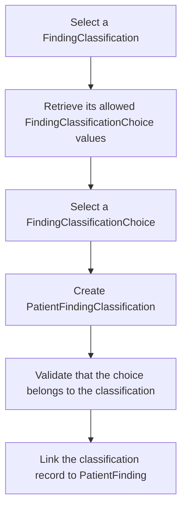

```mermaid
graph TD;

    A["Select a FindingClassification"] --> B["Retrieve its allowed FindingClassificationChoice values"]
    B --> C["Select a FindingClassificationChoice"]
    C --> D["Create PatientFindingClassification"]
    D --> E["Validate that the choice belongs to the classification"]
    E --> F["Link the classification record to PatientFinding"]
```
