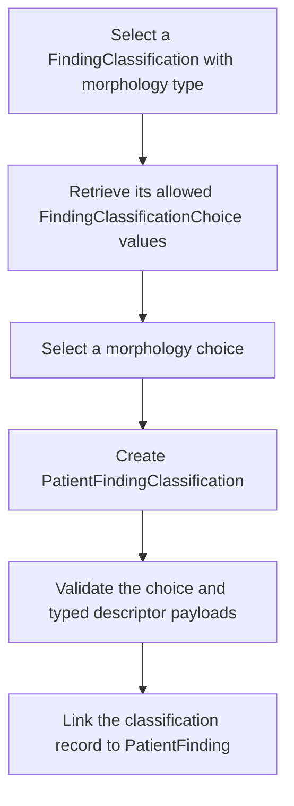

```mermaid
graph TD;

    A["Select a FindingClassification with morphology type"] --> B["Retrieve its allowed FindingClassificationChoice values"]
    B --> C["Select a morphology choice"]
    C --> D["Create PatientFindingClassification"]
    D --> E["Validate the choice and typed descriptor payloads"]
    E --> F["Link the classification record to PatientFinding"]
```
